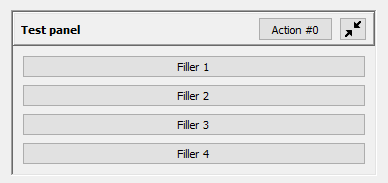

# Readme

Some of DovahKit's custom widgets cannot be properly configured in Qt Designer using 
the "promoted widgets" feature alone, and so require a Qt Designer plug-in. The plug-in 
is a DLL that Qt Designer loads, which offers both the widget's normal behavior, and a 
description of the widget, which Qt Designer can use to enable special editing behaviors. 
This project produces that plug-in.

This project must be compiled in Release, and should produce a DLL. You must then supply 
that DLL to Qt Designer by...

1. Going to the settings for Qt VS Tools and looking at the list of versions.

2. Copying the folder path for the Qt version we're using.

3. Going to the `plugins/designer/` subfolder for the Qt version.

4. Pasting the DLL file inside.

Unfortunately, this makes the DLL available to *all* Qt projects you create, and not 
merely DovahKit. I'm not aware of any way to scope Qt Designer plug-ins to a particular 
Visual Studio solution; there very likely *isn't* a way to do it.

In addition to the above, the code for the widget must be present in both this project 
and the DovahKit project, and in the same file path.

## List of widgets

### DKCollapsiblePane
A collapsible panel with a viewport widget, similar to QScrollArea. QActions can be 
added to the panel directly and will be displayed in its header as buttons.

(Unfortunately, Qt Designer offers no API to allow users to edit a custom widget's 
QActions; the QAction editing on QMenu, QMenuBar, and friends is entirely hardcoded. 
As such, while DKCollapsiblePane supports QActions, you must either create or assign 
the actions to it programmatically.)



### DKFormListPane
A table widget useful for editing lists of forms, e.g. the list of grasses used by a 
LandTexture. The widget can optionally display buttons to manipulate its contents 
(e.g. "Move Up" and "Move Down"), and can arrange its buttons in a column on the side 
or in a row below the list.

## Notes

We include the full code for each custom widget in both DovahKit and this project in 
order to allow the widget to render inside of Qt Designer the same way it'll render 
inside of DovahKit.

Custom widget definitions in Qt are organized as follows:

 - The widget has its own class, as normal.

 - The widget also has a totally separate "interface" class, which derives from the 
   `QDesignerCustomWidgetInterface` class.

 - If the widget needs to use specific behavior extensions, such as `QDesignerContainerExtension`, 
   then the widget should have...

    - ...subclasses of the extension class in question.

    - ...an "extension factory" class, subclassing `QExtensionFactory`, which can be 
      queried to find all pertinent extension classes for this widget.

Each widget's interface class is made known via the central `DovahKitQtCustomWidgetsPlugin` 
class, which in turn is made known to Qt via the `QT_PLUGIN_METADATA` macro.

When writing a widget's code, you should disable its interactive behaviors whenever 
it is loaded in Qt designer. The easiest way to do that is to condition said behaviors 
behind a check for the relevant macro:

```c++
#if !defined(QT_DESIGNER_LIB)
   // ... behaviors that shouldn't happen in Qt Designer ...
#endif
```

That macro is automatically defined by Qt whenever Qt's `designer` module is loaded, and 
that module is only useful when writing plug-ins for Qt Designer.